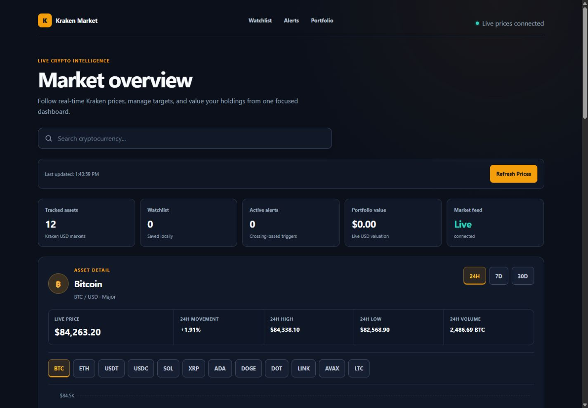
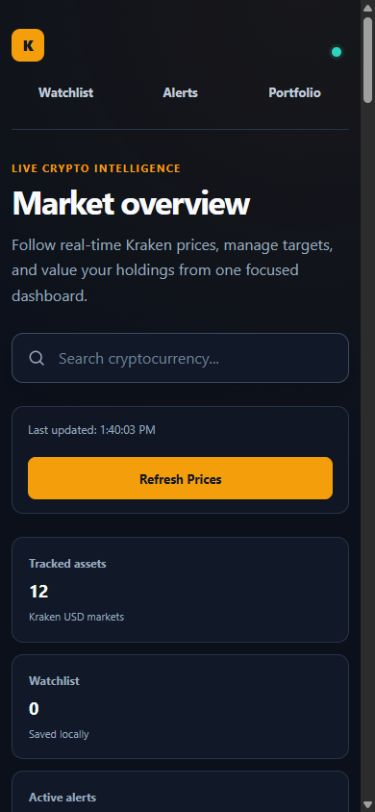
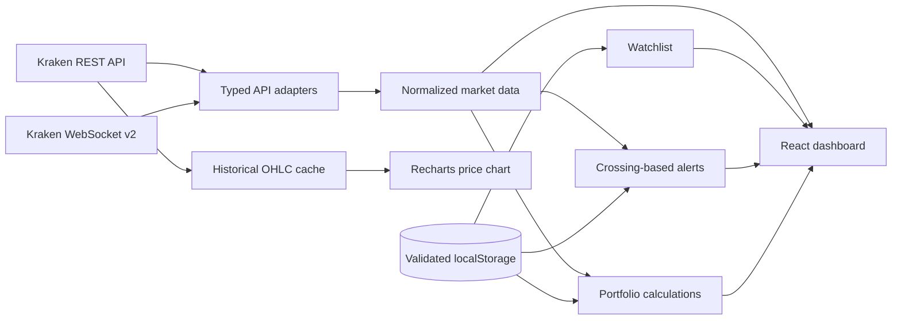

<div align="center">

# Kraken Market Dashboard

**A real-time cryptocurrency dashboard built for fast market monitoring, local portfolio tracking, and focused decision support.**

[](https://react.dev/)
[](https://www.typescriptlang.org/)
[](https://docs.kraken.com/api/)
[](#testing)
[](https://github.com/mohadesehesmaeilzadeh/crypto-price-tracker/actions/workflows/deploy-pages.yml)

[Live Demo](https://mohadesehesmaeilzadeh.github.io/crypto-price-tracker/) · [Features](#features) · [Architecture](#architecture) · [Run Locally](#installation)

</div>

## Overview

Kraken Market Dashboard is a responsive, dark-first finance interface powered by Kraken's public market APIs. It combines an initial REST snapshot with live WebSocket updates, typed historical OHLC data, a persistent watchlist, crossing-based price alerts, and a local portfolio calculator—all without requiring an account or API key.

The application keeps exchange-specific payloads behind typed adapters and exposes normalized market models to the React UI. Watchlists, alerts, and holdings remain private to the browser through validated `localStorage` persistence; live prices are never persisted.

> Market data is informational and may be delayed or unavailable. This project is not financial advice.

## Screenshots

### Desktop dashboard



### Mobile dashboard

<p align="center">
  
</p>

## Features

- Real-time Kraken ticker updates through one shared WebSocket connection
- REST snapshot on startup and manual refresh fallback
- Safe reconnect with connection, disconnected, and reconnecting states
- Responsive 24H, 7D, and 30D historical price charts
- Search by asset name or symbol
- Category filters for Major, Stablecoins, Layer 1, DeFi, and Meme assets
- Sorting by name, price, 24-hour change, and volume
- Persistent watchlist with validation of restored symbols
- Persistent above/below price alerts triggered only on target crossings
- In-app alert notifications with optional browser notifications
- Local holdings tracker with live valuation and profit/loss summaries
- Accessible controls, visible keyboard focus, reduced-motion support, and mobile cards
- Strict TypeScript models and focused automated tests with mocked network behavior

## Supported Assets

| Asset | Symbol | Kraken market | Category |
| --- | --- | --- | --- |
| Bitcoin | BTC | BTC/USD | Major |
| Ethereum | ETH | ETH/USD | Major |
| Tether | USDT | USDT/USD | Stablecoins |
| USD Coin | USDC | USDC/USD | Stablecoins |
| Solana | SOL | SOL/USD | Layer 1 |
| XRP | XRP | XRP/USD | Major |
| Cardano | ADA | ADA/USD | Layer 1 |
| Dogecoin | DOGE | DOGE/USD | Meme |
| Polkadot | DOT | DOT/USD | Layer 1 |
| Chainlink | LINK | LINK/USD | DeFi |
| Avalanche | AVAX | AVAX/USD | Layer 1 |
| Litecoin | LTC | LTC/USD | Major |

Asset identity, REST pair aliases, WebSocket symbols, categories, and icon metadata are defined once in `src/config/cryptocurrencies.ts`.

## Architecture



Key boundaries:

- `src/services/` validates unknown Kraken payloads and normalizes API data.
- `src/types/` owns shared domain, UI, portfolio, alert, chart, and connection types.
- `src/hooks/` isolates historical requests and validated browser persistence.
- `src/utils/portfolio.ts` keeps valuation math outside presentation components.
- `src/components/` receives normalized data and remains independent of raw Kraken response shapes.

## Tech Stack

| Area | Technology |
| --- | --- |
| UI | React 19, semantic HTML, CSS |
| Language | TypeScript 4.9 in strict mode |
| Build | Create React App / React Scripts 5 |
| Charts | Recharts 3 |
| Market data | Kraken REST API and WebSocket v2 |
| Persistence | Browser `localStorage` with runtime validation |
| Testing | Jest, React Testing Library, jest-dom |
| Deployment | GitHub Actions and GitHub Pages |

## Testing

The test suite uses reusable typed fixtures and mocked REST/WebSocket behavior, so it never depends on the live Kraken network.

Coverage focuses on:

- Market loading, error, empty, search, category, and sorting behavior
- Watchlist persistence and invalid stored data
- Above/below price alert crossings and duplicate prevention
- Alert enable, disable, edit, and delete behavior
- Holding and portfolio calculations, persistence, and invalid data
- Historical chart ranges, caching, cancellation, and stale requests
- WebSocket subscription, malformed messages, reconnect, and cleanup

```bash
npm run test:ci
npm run typecheck
npm run build
```

Current result: **28 tests passing across 9 test suites**.

## Installation

### Requirements

- Node.js 20 LTS
- npm 10

```bash
git clone https://github.com/mohadesehesmaeilzadeh/crypto-price-tracker.git
cd crypto-price-tracker
nvm use
npm ci
npm start
```

Open [http://localhost:3000/crypto-price-tracker/](http://localhost:3000/crypto-price-tracker/). Kraken public endpoints require an internet connection; no API key is needed.

Create the production bundle with:

```bash
npm run build
```

The optimized static site is written to `build/` with the repository base path `/crypto-price-tracker/`.

## Challenges

- **Two Kraken protocols:** REST and WebSocket use different pair conventions—most notably Dogecoin's REST alias—so exchange types and mappings are isolated from the UI model.
- **Untrusted external data:** REST responses, WebSocket messages, and persisted browser values are parsed from `unknown` and narrowed before entering application state.
- **Alert correctness:** alerts compare the previous and current live prices so a target fires on a crossing, not repeatedly while the condition remains true.
- **Fast asset switching:** historical requests use caching, abort signals, and request identity checks to avoid duplicate work and stale chart updates.
- **Frequent live updates:** unchanged ticker values preserve existing objects, reducing unnecessary list updates while portfolio and alert calculations stay current.
- **Static hosting:** GitHub Pages serves the app from a repository subpath, so production asset URLs are generated from the configured homepage.

## What I Learned

- How to design a domain layer that keeps raw exchange payloads separate from UI-safe models
- How to manage a single reconnecting WebSocket client through React lifecycle cleanup
- How crossing detection differs from simple threshold evaluation for real-time alerts
- How to validate and version client-side persisted state without storing volatile prices
- How to make financial data readable across tables, cards, charts, and small screens
- How to test asynchronous market behavior deterministically with typed mocks
- How to package and deploy a subpath-hosted React application through GitHub Pages artifacts

## Live Demo

**[Open the Kraken Market Dashboard](https://mohadesehesmaeilzadeh.github.io/crypto-price-tracker/)**

Deployment runs automatically after changes reach `main`. The workflow type-checks, tests, builds, uploads the `build/` artifact, and deploys it to the protected `github-pages` environment.
